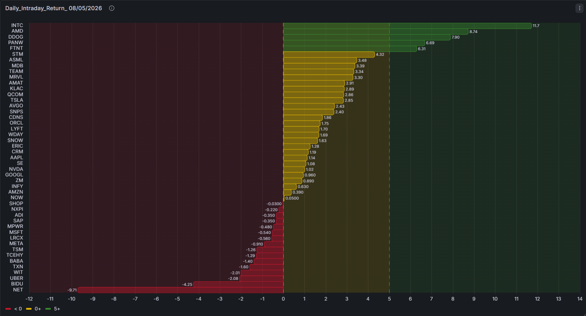

# TechPulse 📈

> An automated ETL pipeline that fetches, transforms, and visualizes daily stock prices of the top 50 global tech companies.

---

## 🚧 Project Status

| Stage | Status |
|---|---|
| Extract | ✅ Completed |
| Transform | ✅ Completed |
| Load | ✅ Completed |
| Visualize | 🔄 In Progress |

---

## 📌 Overview

**TechPulse** is a data engineering project that automates the collection of daily stock price data from the world's top 50 technology companies. The pipeline is orchestrated with Apache Airflow and runs on Docker, storing data in PostgreSQL for further analysis and visualization.

**Companies covered include:** Apple, Microsoft, NVIDIA, Google, Amazon, Meta, Tesla, Samsung, TSMC, Alibaba, and more.

---

## 🏗️ Architecture

```
┌─────────────┐     ┌─────────────┐     ┌─────────────┐     ┌─────────────┐
│   Extract   │────▶│  Transform  │────▶│    Load     │────▶│  Visualize  │
│  yfinance   │     │   pandas    │     │ PostgreSQL  │     │   Grafana   │
└─────────────┘     └─────────────┘     └─────────────┘     └─────────────┘
        │
  Airflow DAG (scheduled daily, Mon–Fri 18:00)
        │
  Docker (containerized environment)
```

---

## 🛠️ Tech Stack

| Tool | Purpose |
|---|---|
| **Python** | Core programming language |
| **yfinance** | Fetch stock price data from Yahoo Finance |
| **pandas** | Data processing and transformation |
| **Apache Airflow** | Pipeline orchestration and scheduling |
| **PostgreSQL** | Data storage |
| **Docker** | Containerized environment |

---
## Advanced version
This project is built with a scalable and industry-relevant tech stack.
**yfinance** handles data extraction from Yahoo Finance, **Apache Airflow**
orchestrates and schedules the pipeline, **Apache Spark / Databricks**
processes large-scale historical stock data, **PostgreSQL** stores the
transformed data, and **Grafana** visualizes real-time dashboards.

This stack covers the full spectrum of Data Engineering roles:
Airflow → Data Engineer, Spark → Big Data Engineer,
Databricks → Cloud Data Engineer.

---
## 📁 Project Structure

```
TechPulse/
├── dags/
│   └── techpulse_dag.py          # Airflow DAG definition
├── scripts/
│   ├── extract.py                # Fetch stock data from yfinance
│   ├── transform/
│   │   ├── __init__.py
│   │   ├── daily_return.py       # Calculate daily price change
│   │   ├── moving_average.py     # Calculate moving averages (7d, 30d)
│   │   ├── volatility.py         # Measure price volatility
│   │   ├── volume_anomaly.py     # Detect abnormal trading volume
│   │   ├── sector_performance.py # Compare performance by sector
│   │   └── correlation.py        # Correlation matrix between companies
│   └── load.py                   # Load data into PostgreSQL
├── docker-compose.yaml           # Docker services configuration
├── requirements.txt              # Python dependencies
└── README.md
```

---

## 📊 Planned Analysis

| Analysis | Description |
|---|---|
| **Daily Return** | Top 5 gainers and losers each day |
| **Moving Average** | 7-day and 30-day price trends |
| **Volatility** | Identify stable vs high-risk stocks |
| **Volume Anomaly** | Detect unusual trading activity |
| **Sector Performance** | Compare semiconductors vs software vs e-commerce |
| **Correlation** | Discover which companies move together |

---

## 🚀 Getting Started

### Prerequisites
- Docker & Docker Compose
- Python 3.8+

### Installation

**1. Clone the repository**
```bash
git clone https://github.com/your_username/TechPulse.git
cd TechPulse
```

**2. Start Docker services**
```bash
docker-compose up airflow-init   # Initialize Airflow
docker-compose up -d             # Start all services
```

**3. Install Python dependencies (inside container)**
```bash
docker exec -it techpulse-airflow-webserver-1 pip install yfinance
```

**4. Access Airflow UI**
```
http://localhost:8080
```

**5. Trigger the DAG**
```
DAG name: fetch_top50_tech_stock_prices
```

---

## ⏰ Schedule

The pipeline runs automatically **Monday to Friday at 18:00** (after market close):

```
schedule_interval = "0 18 * * 1-5"
```

---

## 🗂️ Top 50 Tech Companies (Sample)

| Ticker | Company | Country |
|---|---|---|
| AAPL | Apple | 🇺🇸 USA |
| MSFT | Microsoft | 🇺🇸 USA |
| NVDA | NVIDIA | 🇺🇸 USA |
| GOOGL | Alphabet (Google) | 🇺🇸 USA |
| BABA | Alibaba | 🇨🇳 China |
| 005930.KS | Samsung | 🇰🇷 Korea |
| SAP | SAP | 🇩🇪 Germany |
| INFY | Infosys | 🇮🇳 India |
| ... | ... | ... |

---

## 📝 Data Visualization
### Daily Intraday Return — August 5, 2026


> 🔗 [View Live Dashboard](http://localhost:3000/public-dashboards/ae1cf38d4d3043fba476cc2fc1bc3847)

#### Description
This horizontal bar chart visualizes the intraday return percentage of a selection of stocks for the trading day of August 5, 2026, sourced from a PostgreSQL database and rendered via Grafana.
Stocks are ranked in descending order from highest to lowest intraday return, providing a quick snapshot of the day's top performers and underperformers.
#### Color Legend

🟢 Green (5+) — Strong positive return, above +5%
🟡 Yellow (0+) — Moderate positive return, between 0% and +5%
🔴 Red (< 0) — Negative return, below 0%

#### Key Observations

INTC was the top performer of the day with an intraday return of +11.7%
AMD, DDOG, PANW also posted strong gains above +7%
The majority of stocks recorded modest positive returns between 0% and +5%
NET, BIDU, UBER were the worst performers, with returns falling as low as -9.71%
Overall market sentiment was broadly bullish, with most stocks finishing in positive territory

#### Data Source

Database: PostgreSQL (transformed_daily_return table)
Visualization: Grafana Bar Chart
Query: Stocks filtered by most recent trading date, ordered by intraday_return_pct DESC
---

## 📝 License

This project is licensed under the MIT License.

---

## 👤 Author

**Jie Li**
- GitHub: [@wangunuxe](https://github.com/wangunuxe)